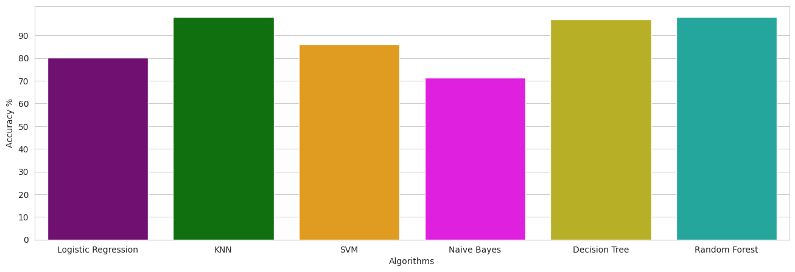

# Klasifikasi Penyakit Jantung

Repository ini dibuat untuk mempelajari dan menerapkan berbagai metode klasifikasi machine learning dalam mendeteksi penyakit jantung. Melalui eksperimen ini, kita mencoba berbagai algoritma untuk melihat mana yang memberikan akurasi terbaik dalam memprediksi kondisi kesehatan jantung pasien.

## Algoritma yang Digunakan

Dalam proyek ini, beberapa algoritma klasifikasi telah diuji, termasuk:

- **Logistic Regression**
- **K-Nearest Neighbors (KNN)**
- **Support Vector Machine (SVM)**
- **Naive Bayes**
- **Decision Tree**
- **Random Forest**

## Hasil

Gambar di bawah ini menunjukkan akurasi dari setiap model yang diuji:



Dari hasil di atas, dapat disimpulkan bahwa model **KNN** dan **Random Forest** memberikan performa terbaik dalam klasifikasi penyakit jantung, dengan akurasi yang lebih tinggi dibandingkan algoritma lainnya.

## Usage

1. **Clone Repository:**
   ```bash
   git clone https://github.com/username/klasifikasi-penyakit-jantung.git
